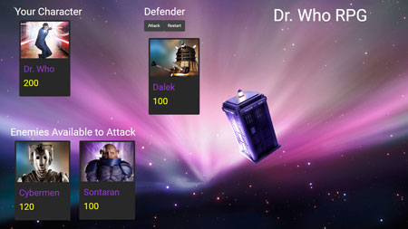

# Dr. Who RPG Game

### Dr. Who variation of Star Wars Game, Homework Assignment Week 4 Game.

### Instructions for game play

Game starts by selecting your character from the "players character list" and a character from the "enemies list" and
press the atack button, when the button is clicked you will do battle with the enimies charecter and it will remove
health points from both the "selected player character" and the "enimie character" until one player is out of health points.

The game ends when the "selected player" or "enimie" dies by running out of health points or when "selected players 
character" defeates all of the "enimie charecters" available. 

### Game design notes

* Each character in the game has 3 attributes: Health Points, Attack Power and Counter Attack Power.
* Each time the player attacks, their character's Attack Power increases by its base Attack Power.
 - For example, if the base Attack Power is 6, each attack will increase the Attack Power by 6 (12, 18, 24, 30 and so on).

* The enemy character only has Counter Attack Power.
  - Unlike the player's Attack Points, Counter Attack Power never changes.
* The Health Points, Attack Power and Counter Attack Power of each character must differ.
* No characters in the game can heal or recover Health Points.
  -A winning player must pick their characters wisely by first fighting an enemy with low Counter Attack Power. This will allow them to grind Attack Power and to take on enemies before they lose all of their Health Points. Healing options would mess with this dynamic.
  
* Your players should be able to win and lose the game no matter what character they choose. The challenge should come from picking the right enemies, not choosing the strongest player.

### TO Dos when i have additional time

* Review the point scoring system